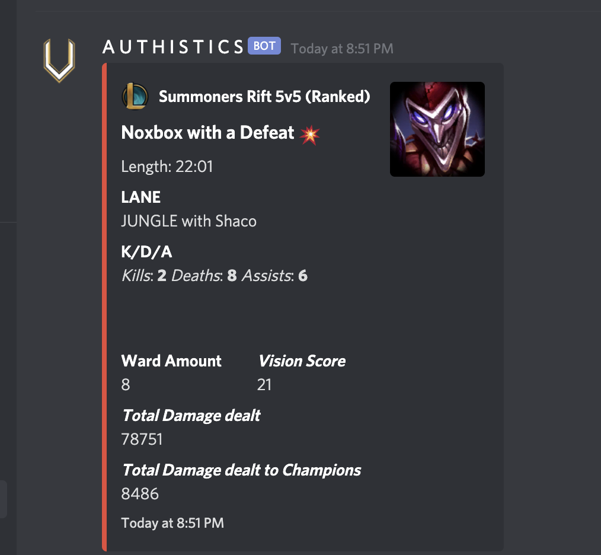
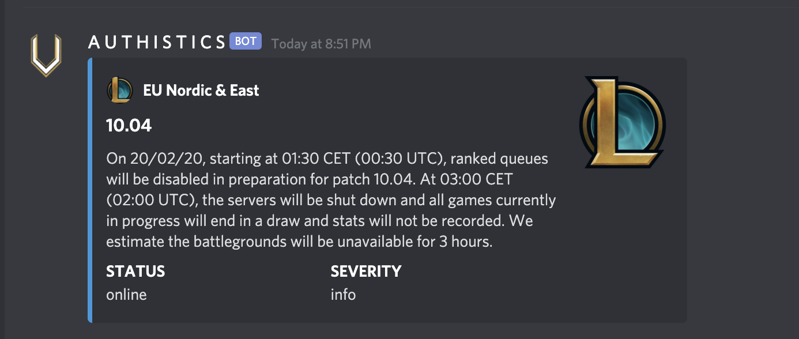
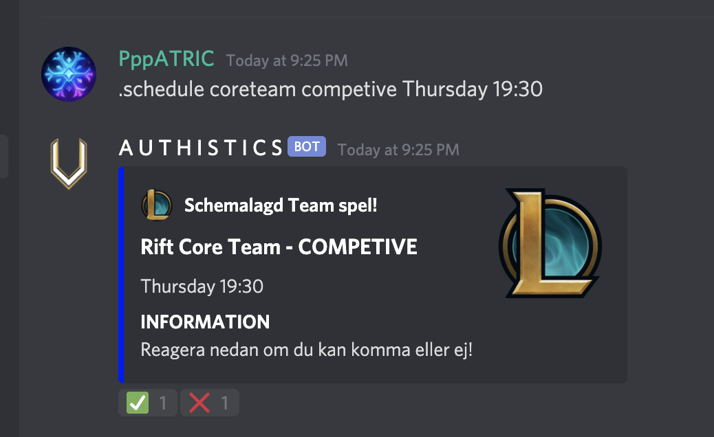

# League of Legends Team Discord Bot

A discord bot made specifically for League of Legends teams, clans and organisations
that homes in a Discord server.

## Requirements

So far, this bot isn't a public bot and therefore needs to be self-hosted.

* NodeJS
* MongoDB 
* [Personal Riot Games API key](https://developer.riotgames.com/docs/portal#web-apis_api-keys)

## What this bot can do: 

* Announces server status, interval 1 minute.
* Announces new game results from members, interval 1 minute.
* Command to schedule future games with team.

### Game results

### Server Status

### Schedule a game with your team

## Project information

### Packages/Software

* Mongoose
* MongoDB
* NodeJS

### API
* Discord.JS
* Riot Games API

## How to setup

First of all, make sure you have an MongoDB cloud or local server configured.

copy the `.env.example` file and adjust it to your channel id's, bot token and 
other settings to tune it for your server.

Run by using node.
> node index.js 

## Contributing

All changes that makes the bot more wealthy in features, speed and UI improvements 
are always highly appreciated and very welcome.

Please see [CONTRIBUTING](docs/CONTRIBUTING.md) for more details.

## Credits

- [PatricNox](https://github.com/PatricNox)
- [All Contributors](../../contributors)

## License

The MIT License (MIT). Please see [License File](LICENSE.md) for more information.
